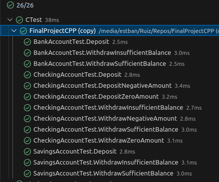

# FinalProjectCPP: Bank Account Management System

## Project Overview

This project evaluates your understanding of essential C++ concepts, including object-oriented programming, modern C++ features, templates, and memory management. You will implement a banking system with classes for savings and checking accounts while adhering to modern coding practices. Optional advanced topics, like multi-threading and design patterns, can earn bonus points.

---

## Topics to Cover

Your implementation must demonstrate the following:

### Core Topics
- **Object-Oriented Programming (OOP)**:
  - Abstract classes and pure virtual methods
  - Inheritance and polymorphism
  - Constructors, destructors, and encapsulation
- **Modern C++ Features**:
  - Smart pointers (`std::unique_ptr` and `std::shared_ptr`) for memory management
  - Use of `auto`, `constexpr`, and range-based loops
- **Templates**:
  - Function templates for reusable operations
  - Class templates for generic implementations
- **Error Handling**:
  - Use of exceptions and `try-catch` blocks for robustness
- **C++ Standard Library (STL)**:
  - Usage of `std::vector`, `std::string`, and STL algorithms

### Advanced Topics (Bonus Points)
- **Multi-threading**:
  - Thread-safe operations using `std::mutex` and `std::thread`
  - Demonstrate concurrency in bank account operations
- **Design Patterns**:
  - Singleton or Factory for account creation
- **Advanced Templates**:
  - Variadic templates or template specialization

---

## Project Structure

```plaintext
FinalProjectCPP/
├── CMakeLists.txt           # Root CMake configuration file
├── include/                 # Header files
│   ├── BankAccount.h        # Abstract base class
│   ├── CheckingAccount.h    # Checking account class
│   ├── SavingsAccount.h     # Savings account class
│   ├── ThreadSafeAccount.h  # (Optional) Thread-safe wrapper
│   ├── StudentCode.h        # Additional implementations (student file)
├── src/                     # Source files
│   ├── BankAccount.cpp      # Base class implementation
│   ├── CheckingAccount.cpp  # Checking account implementation
│   ├── SavingsAccount.cpp   # Savings account implementation
│   ├── ThreadSafeAccount.cpp # (Optional) Thread-safe wrapper
│   ├── StudentCode.cpp      # Additional implementations (student file)
│   ├── CMakeLists.txt       # CMake configuration for the src directory
├── tests/                   # Unit tests
│   ├── TestBankAccount.cpp  # Predefined test cases
│   ├── CMakeLists.txt       # CMake configuration for tests
└── README.md                # Project instructions
```

---

## What to Implement

### Core Requirements

1. **Abstract Base Class: `BankAccount`**
   - Define the following pure virtual methods in `BankAccount.h`:
     - `void deposit(double amount)`
     - `bool withdraw(double amount)`
     - `void displayAccountInfo() const`
   - Attributes:
     - `int accountNumber`
     - `std::string accountHolderName`
     - `double balance`

2. **Derived Classes**:
   - **`SavingsAccount`**:
     - Add an interest rate attribute.
     - Implement `deposit`, `withdraw`, and `displayAccountInfo`.
     - Add logic to calculate interest on the balance.
   - **`CheckingAccount`**:
     - Add overdraft protection logic.
     - Implement `deposit`, `withdraw`, and `displayAccountInfo`.

3. **Templates**:
   - Write a **function template** to implement reusable operations like sorting or searching accounts.
   - Write a **class template** to create a generic analytics class for bank accounts.

4. **Student Implementations in `StudentCode.cpp`**:
   - Add any helper classes, methods, or utilities needed for your design.
   - If required, create new files and organize them under the `include` and `src` directories.

### Advanced Features (Optional)
1. **Thread-Safe Wrapper (`ThreadSafeAccount`)**:
   - Use `std::mutex` to ensure thread-safe operations on `BankAccount`.
   - Use `std::thread` to simulate concurrent transactions.

2. **Design Patterns**:
   - Implement a Singleton or Factory pattern for account creation and management.

3. **Advanced Templates**:
   - Implement variadic templates for flexible data structures.
   - Use template specialization for custom behaviors.

---

## Steps to Build and Run

1. Clone the repository:
   ```bash
   git clone <repository_url>
   cd FinalProjectCPP
   ```

2. Build the project:
   ```bash
   cmake -S . -B build
   cmake --build build
   ```

4. Add your implementations in `StudentCode.cpp` and `StudentCode.h`.

5. Submit only the `StudentCode.cpp` and `StudentCode.h` files for evaluation.


## Evaluation Process

1. **Unit Tests**:
   - Tests in `TestBankAccount.cpp` will be used to assess your implementation.
   - **Do not modify or build the test files.** They are preconfigured for evaluation.

2. **Coding Style**:
   - Adherence to the [C++ Evaluation Guide](./C++EvaluationGuide.md).

3. **Advanced Topics**:
   - Bonus points for implementing optional features like multi-threading, templates, and design patterns.

4. **Final Output**:
   - The final implementation should passes all tests and follows coding best practices.
   



# C++ Evaluation Guide

## Topics to Cover

### Core Topics
1. **Object-Oriented Programming**:
   - Abstract classes and virtual methods (`BankAccount`).
   - Inheritance and polymorphism with `SavingsAccount` and `CheckingAccount`.
   - Encapsulation, constructors, and destructors.

2. **Templates**:
   - Function templates for reusable operations.
   - Class templates for generic data structures or analytics.

3. **Memory Management**:
   - Use smart pointers (`std::unique_ptr`, `std::shared_ptr`) instead of raw pointers.
   - Avoid memory leaks and dangling references.

4. **Error Handling**:
   - Handle invalid operations with exceptions.
   - Use `try-catch` blocks to handle errors gracefully.

5. **C++ Standard Library (STL)**:
   - Use STL containers (`std::vector`, `std::string`) and algorithms.

---

### Advanced Topics (Bonus Points)

1. **Multi-threading**:
   - Demonstrate concurrent operations using `std::thread`.
   - Ensure thread-safe operations using `std::mutex`.

2. **Design Patterns**:
   - Use a Singleton pattern for account management.
   - Use a Factory pattern for creating different types of accounts.

3. **Advanced Templates**:
   - Implement variadic templates for flexible operations.
   - Use template specialization to customize behaviors.

---

## Guidelines

### Code Organization
- **Headers (`include/`)**:
  - All `.h` files must reside in the `include` directory.
- **Source Files (`src/`)**:
  - All `.cpp` files must reside in the `src` directory.

### Naming Conventions
- Classes and Files: PascalCase (`BankAccount`, `CheckingAccount.cpp`).
- Variables and Functions: camelCase (`accountNumber`, `calculateInterest`).

### Testing
- Unit tests are preconfigured and **must not be modified**.
- Focus on implementing the required methods to pass the tests.

---

## Evaluation Criteria

1. **Correctness**:
   - Does the implementation pass all test cases?

2. **Code Quality**:
   - Is the code modular, readable, and maintainable?

3. **Use of Modern C++**:
   - Are modern features like smart pointers, templates, and STL effectively utilized?

4. **Advanced Features**:
   - Are optional features like multi-threading and templates implemented for bonus points?

5. **Performance**:
   - Is the code efficient, free of memory leaks, and thread-safe where required?

---

Follow this guide to ensure your project adheres to the requirements and best practices.
